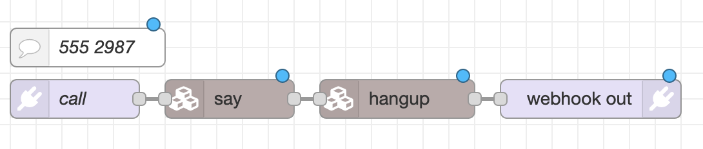

# Programmable Communications

As part of the EMF Phone Operations Centre (POC) this year, we have a set of programmable
communications APIs that you can use to interact with the phone network and build your own
services.

This is based on the open source [jambonz](https://www.jambonz.org) platform, which has APIs for incoming
and outgoing calls similar to some of the other programable communications platforms on the
market. The key thing is that this one can call and be called from the EMF site phone network.

You can find the details on the API at [https://www.jambonz.org/docs/](https://www.jambonz.org/docs/)

Jambonz can place calls to other EMF phones but not out to the public phone network.

If you want to learn more, you can come to our workshop on Programming the EMF Phone network
with Jambonz and Node-RED - see the schedule for details. Or come visit the POC in the info
tent. You can also e-mail us questions on poc@emfcamp.org

# Configure An Application
To use this method, you need coding knowledge, and a place to host your app online. We recommend you read the [Jambonz API Documentation](https://www.jambonz.org/docs/) before configuring an application.

Start by signing up at [https://jambonz.emf.camp/signup](https://jambonz.emf.camp/signup).

Anything you set up here is not easily editable, so double check before you submit

The most important things here are:

* Answer URL: Webhook that's called when someone rings the application number
* Email Address:  Setup confirmation and phone number will be sent to this email address.

The system will create an app, allocate you a phone number in the range 555 XXXX, and e-mail you the details.

# Testing Applications Before The Event
If you want to test your application prior to camp, you can call it by dialling 0117 200 1500
and then entering your 555 XXXX application number when prompted.

# Make a Low-Code Application with Node-RED

We have a platform you can use to create your phone apps on or non-phone apps that interact
with the badge or any of the other APIs at EMF. 

Its provided by [FlowForge](https://flowforge.com) and allows you to run the open source
[Node-RED](https://nodered.org) tool, which privides low code programming for event driven
applications. We'll be using it in our workshop about programming the phone network.

If you would like an account, please e-mail poc@emfcamp.org as we only have limited capactity.

## Set up a Flowforge/Node-RED Project
1. Log into [Flowforge at https://app.emfcamp.app](https://app.emfcamp.app)
1. Create a team if you don't have one already
1. Create a project
1. Make a note of your editor URL, you'll need this later
	* It'll look like `https://<projectname>.emfcamp.app`
1. Click editor at the top right
1. Click burger menu at top right
1. Select Manage Palette
1. Select the Install Tab
1. Search for Jambonz
1. Install @jambonz/node-red-contrib-jambonz
1. Click install to confirm the warning message
1. Wait about 1.5 minutes, and it'll show as installed and appear on the Nodes tab.
1. Close the Palette settings

Jambonz nodes will now appear on the menu on the left.

[Jambonz Node-RED Node Documentation](https://flows.nodered.org/node/@jambonz/node-red-contrib-jambonz)

## Create your first Node-RED flow
1. Scroll down to the Jambonz Section on the left hand side of Node RED
2. Every flow must start and end with a webhook, so drag in a `webhook in` and a `webhook out`
3. Configure the Webhook In as set up above
	* Name: Call
	* Method: GET
	* Path: `/call`
4. Drag in a `Say` node and a `Hangup` node.
5. Configure the `Say` node
	* Text: `Did this work first time?`
	* Loop: 0
6. Connect the nodes in the order call, say, hangup, webhook out.
7. If you like drag in a `comment` node from the Common section, and name it with your 555 XXXX extension as a reminder.
8. Click Deploy
9. Test your flow by ringing 0117 200 1500
and entering your 555 XXXX number when prompted.

	
## Connect a phone number to the Node-RED Project
1. Go to [https://jambonz.emf.camp/signup/](https://jambonz.emf.camp/signup/)
	* Anything set up here is not easily editable, so double check before you submit
1. App Name: Type in the the project name you used earlier
2. Answer URL: Use your Editor URL from earlier with /call on the end, for example: `https://<projectname>.emfcamp.app/call`
3. Status URL: Use your Editor URL from earlier with /status on the end, for example: `https://<projectname>.emfcamp.app/status` 
4. Email Address: Setup confirmation and phone number will be sent to this email address.
5. Click Submit.
	* The form will clear, but won't look like much has happened. Wait a few minutes then check your email for confirmation.

# Stage Audio

Live audio from each of the stages is available on your phones by dialling the following numbers:

* 555 5001 - Stage A
* 555 5002 - Stage B
* 555 5003 - Stage C

Where a speaker has opted not to have their talk recorded, this feed will be unavailable.

For questions on this API, please e-mail poc@emfcamp.org
